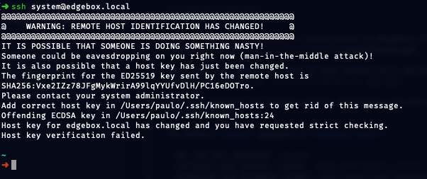
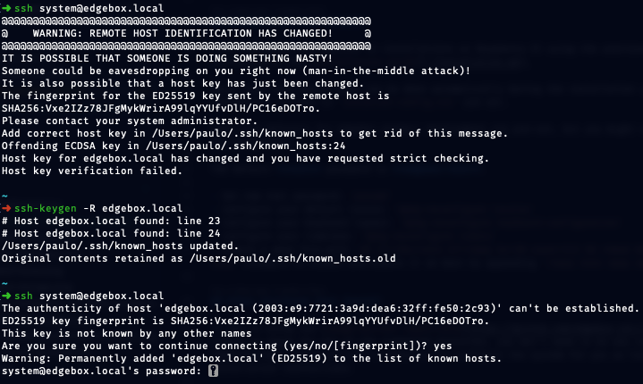

# ⚠️ Common Errors

Here are some common errors that you may encounter while setting up or using edgebox. These are not exhaustive, but should cover the most common issues you may face:


??? "SSH Connection Warning"

    SSH Connection Warning
    

    If you are trying to connect to your edgebox using SSH and you get a warning, it is likely that the you had a previous box with the same name and the SSH key has changed. To fix this, you can delete the old key from your `~/.ssh/known_hosts` file. Run the following command:

    ```bash
    ssh-keygen -R edgebox.local
    ```

    If you try connecting again, the issue should now be clear.
    


## 🤔 My issue is not here

If your issue is not here, please write an e-mail to [info@edgebox.io](mailto:info@edgebox.io) and report it. Please take look at the ["Contributing"](../contributing.md) page to see more details and tips on reporting issues.