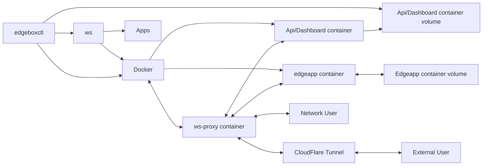

# 🏗️ System Architecture

The Edgebox system is composed of several components that interact and work together to provide the functionality of the system.

## Architecture Diagram

Below you can see a diagram of the system architecture that shows the main components and how they interact with each other.

## Component Descriptions

__Here's a small explainer about each core component:__

### `edgeboxctl`

The main system control service, running at the operating system level, and responsible for interfacing between the operating system and the edgebox system, providing features like running operations on a clock tick, docker container orchestration management (via `ws` or `directly`) and status reporting (parsing from various sources and sometiemes saving this information in the `api` db for dashboard display).

### `api`

Is responsible for serving a database that manages the dashboard and status report storage created by `edgeboxctl`. It also hosts the main web dashboard where the user can manage some of the system features. `api` never interfaces directly with `edgeboxctl`, instead leaves "tasks" in its database that are picked up by the system service and executed accordingly.

### `apps`

The applications that run on the Edgebox system. They are the container definitions that provide the services necessary to create the apps and give you the functionality that you would normally get from cloud services. Each application has its own folder and follows some conventions regarding configuration file definitions, binary file definitioons, and others. `ws` uses this information to create your containerized applications.

### `ws`

Web Services orchestration module. It is a service itself (a proxy pass) that is responsible for routing the requests to the correct applications installed in the system, but also a set of utilities that can read the `apps` folder for definitions, manage their state, and order `docker` to run them.
