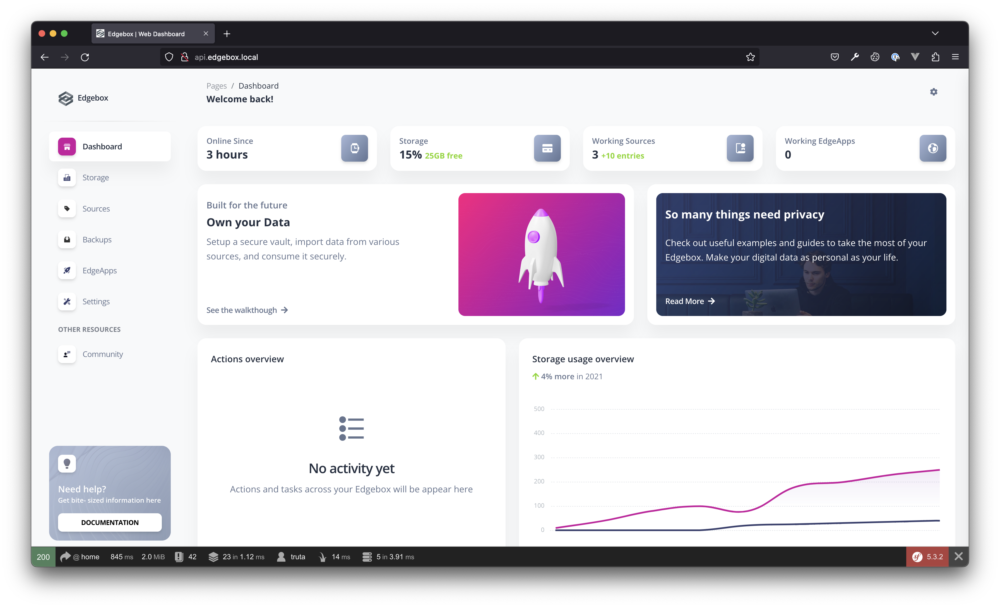
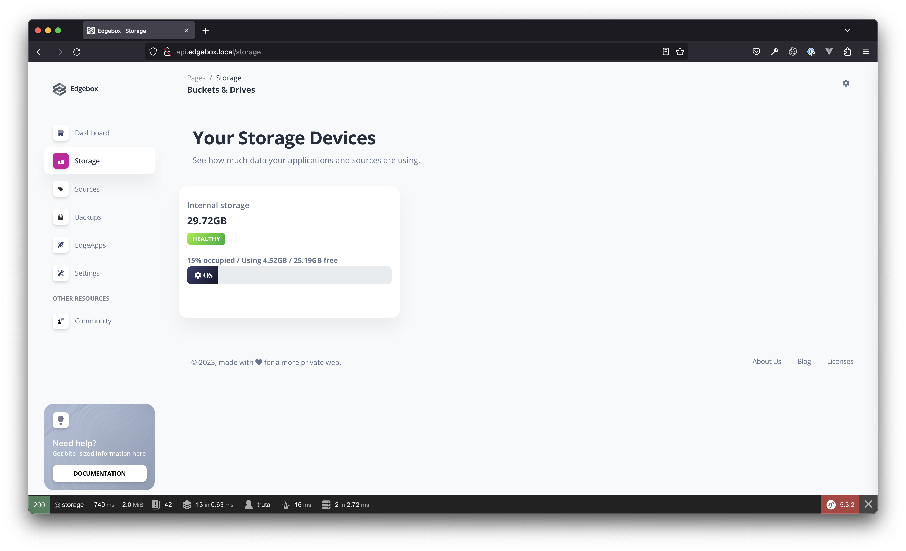
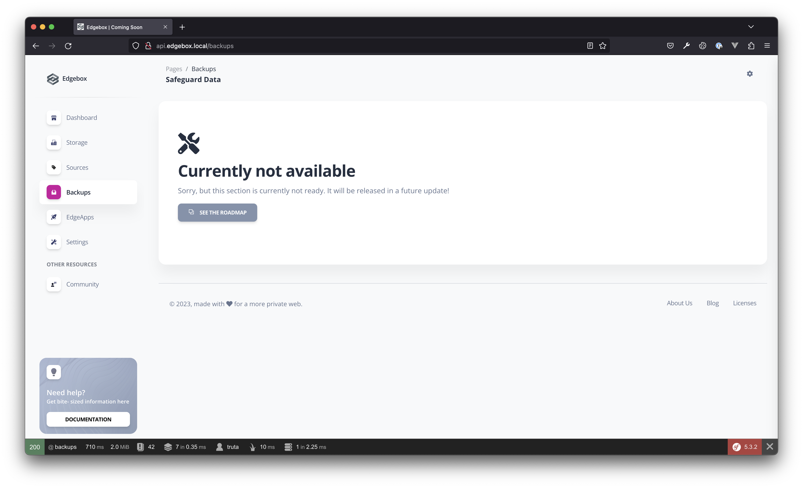
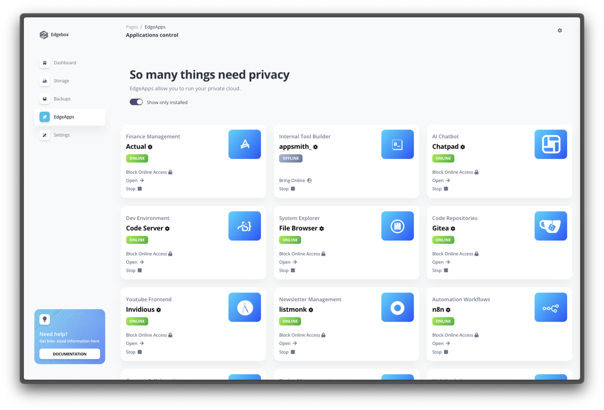
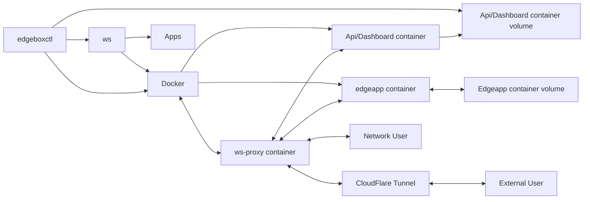

# Overview

This is a quick overview of the main features of the project. Edgebox system is a simple, yet powerful, system that allows you to run your own cloud applications.
Accessing your Edgebox system is as simple as opening a web browser and navigating to the url of your Edgebox system.

## Dashboard

The dashboard is the main interface for the Edgebox system. It provides a simple way to control the system, and access the various features and applications.

### Storage

Edgebox provides a simple way to store your data. It is a simple, yet powerful, file storage system.  In the storage section, you can see information about the storage occupation, attach new storage devices, and manage the storage.

### Backups

The backup section allows you to backup your data to a remote location. It is a simple and straightforward way to backup your data to a remote location or an external storage device, and restore it if needed. Backups are encrypted before transit so they are fully secure and only accessible by you.

In this screen, you can also see all the backups you have made, and restore your edgebox system to one of the previous backups.

_Note: The backups function is currently in development. It will be available in a future release._

### Edgeapps

Edgeapps are the applications that run on the Edgebox system. They are one of the highlight features. They are the applications that provide the functionality that you would normally get from cloud services. They can be easily installed, uninstalled, updated and configured.

## System Architecture

The Edgebox system is composed of several components. The main components are:

- `edgeboxctl`, which is the main system control service, running at the operating system level, and responsible for interfacing between the operating system and the edgebox system, providing features like running operations on a clock tick, docker container orchestration management (via `ws` or `directly`) and status reporting (parsing from various sources and sometiemes saving this information in the `api` db for dashboard display).
- `api`, which currently is responsible for serving a database that manages the dashboard and status report storage created by `edgeboxctl`. It also hosts the main web dashboard where the user can manage some of the system features. `api` never interfaces directly with `edgeboxctl`, instead leaves "tasks" in its database that are picked up by the system service and executed accordingly.
- `apps` are the applications that run on the Edgebox system. They are the container definitions that provide the services necessary to create the apps and give you the functionality that you would normally get from cloud services. Each application has its own folder and follows some conventions regarding configuration file definitions, binary file definitioons, and others. `ws` uses this information to create your containerized applications.
- `ws` is the web services orchestration module. It is a service itself (a proxy pass) that is responsible for routing the requests to the correct applications installed in the system, but also a set of utilities that can read the `apps` folder for definitions, manage their state, and order `docker` to run them.

