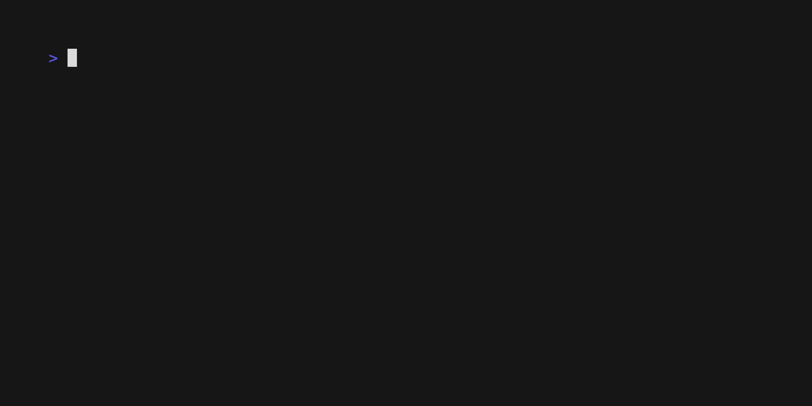
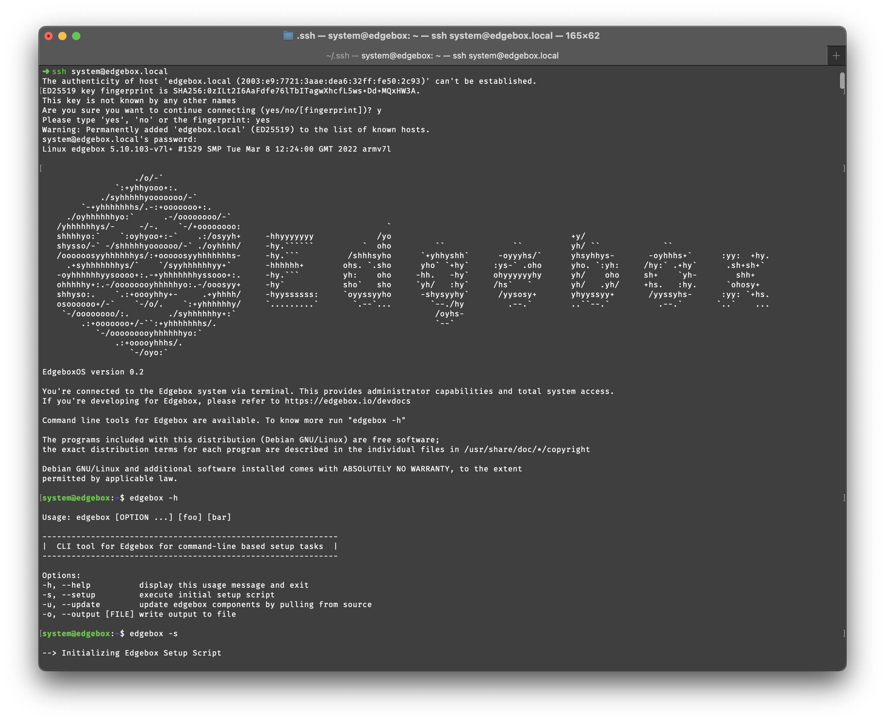

# Installation Setup

This section describes how to install the software on your server. Depending on the platform, the installation process may vary.

## Locally

_(Coming soon)_ - We are currently working on a local installation setup. This will allow you to run Edgebox on your local machine, without the need for a server. This is useful for testing and development purposes.

## Raspberry Pi

The Raspberry Pi is a small, inexpensive, single-board computer that can be used to run Edgebox. This is a quick and easy way to get a self-hosted system up and running.

The installer requires an initial setup on your computer, but after that, it is completely unattended. You need to have a working internet connection through the ethernet port or use the onboard wireless LAN.

### Hardware

To run Edgebox on a Raspberry Pi, you will need the following hardware:

- Raspberry Pi 4 (4GB recommended) with ethernet or wireless LAN and a working internet connection
- SD Card (256GB+ recommended, but it works with as little as 16GB)
- A way to write the SD Card from your computer (e.g. SD Card reader)

### Setup

After you have the hardware, you need to setup the SD card. This is a one-time process that will be aided by our `ua-netinst-config` tool.

- Go to [ua-netinst-config](https://github.com/edgebox-iot/ua-netinst-config) and download the latest version .zip file or clone the repository. This installer will be able to configure an operating system image that runs Edgebox on the Raspberry Pi.
- Run the command `make install` to start the configuration process for the image. Answer the questions and wait for the process to finish.
- Copy the contents inside the resulting "image" folder into a freshly formatted SD card as **FAT32** (MS-DOS on _Mac OS X_)

### Installation

Under normal circumstances, you can just insert the SD card, power on your Edgebox and cross your fingers.

If you don't have a display attached, you can monitor the ethernet card LEDs to guess the activity status. When it finally reboots after installing everything you will see them illuminate on and off a few times when Raspbian configures on boot.

If the installation process fails, you will see **SOS** in Morse code (... --- ...) on an led.  In this case, power off the Pi and check the log on the sd card.

If you do have a display, you can follow the progress and catch any possible errors in the default configuration or your own modifications. Once a network connection has been established, the process can also be followed via telnet (port 23).

If you have a serial cable connected, installer output can be followed there, too. If 'console=tty1' at then end of the `cmdline.txt` file is removed, you have access to the console in case of problems. Installation takes about **20 minutes** with fast internet from power on to system fully running.

### Setup Script

Included after installation in `~/home/system/` is a basg script with the name `edgebox.sh`. This script can be ran after installation to setup the necessary components for a proper functioning Edgebox. It can be run anywhere in a terminal as it is pre-included in the PATH.

The recommendation is that after installation, you should run the setup script. The system is SSH accessible through `ssh system@edgebox`, using the password set on the `installer-config.txt` file.

The available commands are:

 - edgebox -s | --setup -> Setup script, configures GitHub SSH Key (if it exists), and downloads all repositories and starts all components. Project files are available at `~/home/system/components` >
 - edgebox -u | --update -> Pulls all newest commits form every repository in the project.

## Other Platforms

We have a simple to use installer that will build ready to use images of Edgebox for various environments, including DigitalOcean.
To use it, go to the [edgebox-iot/image-builder](https://github.com/edgebox-iot/image-builder) repository and follow the instructions there.

_Note: We will be adding more platforms in the future, and porting the Rasberry Pi installer to this repository as well._