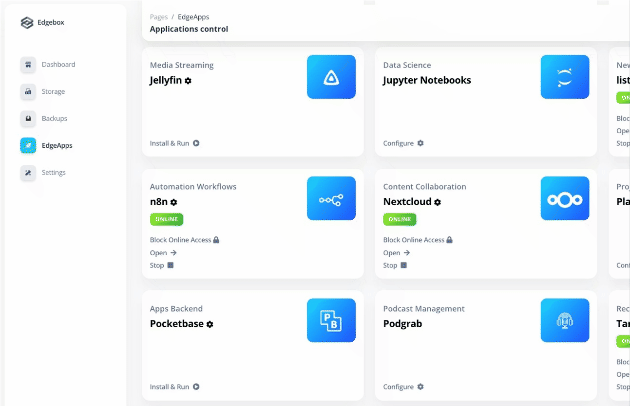
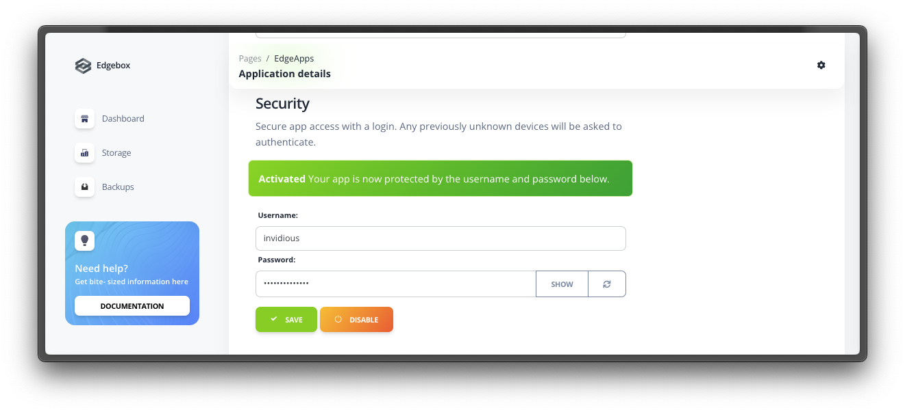
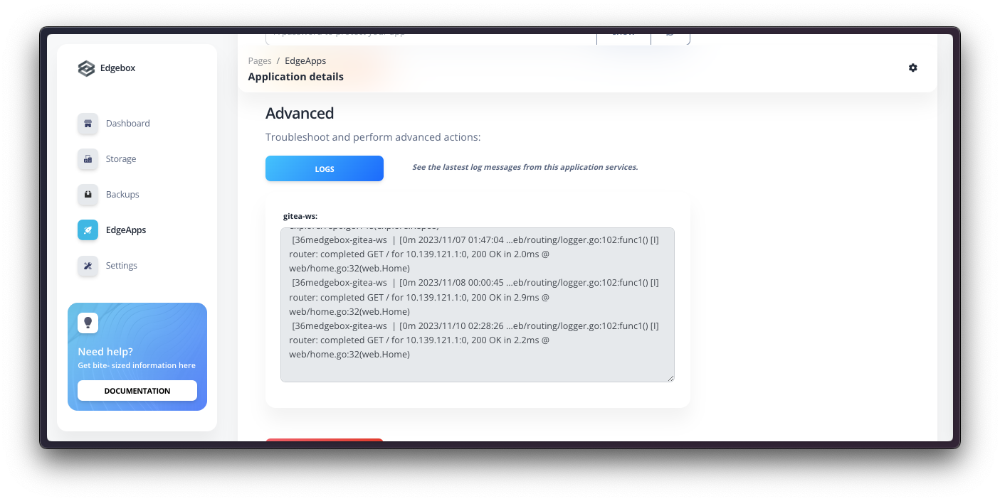

# Edgeapps

**Edgeapps are the applications that run on the Edgebox system.** These applications expand the capabilities of Edgebox by providing functionality that you would normally get from (paid) cloud services.

EdgeApps can be easily installed, uninstalled, updated and configured using the dashboard only.

In the "_**EdgeApps**_" page, accessible through the dashboard main menu, you can see all the apps that are installed in your system, manage them, and install new apps.

## ✅ Available EdgeApps

Edgebox allows you to 1-click install a list of selected apps, each handpicked to provide some specific functionality. You can install and use them as you need. Here's a reference of the apps that are currently available, and what they do:

| Name | Description | Companion Apps | Is Stable |
|---|---|:---:|:---:|
| [`actual`](/usage/edgeapps/actual) | Handles personal or small business budgeting | ❌ | ✅ |
| [`appsmith`](/usage/edgeapps/appsmith) | Allows you to build tools to automate tasks and interact with other services. Create data entry apps, dashboards, etc | ❌ | ✅ |
| [`bitwarden`](/usage/edgeapps/bitwarden) | Securely manage and synchronize passwords and 2FA codes across devices and other people | ✅ | ✅ |
| [`calibre`](/usage/edgeapps/calibre) | Handles E-book library management, format conversion, and syncing to e-book reader devices | ❌ | ✅ |
| [`chatpad`](/usage/edgeapps/chatpad) | A front-end to automate, communicate, and save your conversations with ChatGPT or other AI Providers | ❌ | ✅ |
| [`conduit`](/usage/edgeapps/conduit) | A provider to send and receive messages in a decentralized, end-2-end encrypted and trustless manner. Includes a web front-end (Element) to use it. | ❌ | ❌ |
| [`filebrowser`](/usage/edgeapps/filebrowser) | Web file management tool to access every folder and view text files inside the Edgebox system or apps it is running | ❌ | ✅ |
| [`focalboard`](/usage/edgeapps/focalboard) | Helps track tasks, plan projects, and organize information shared among family or teamu members | ❌ | ❌ |
| [`gitea`](/usage/edgeapps/gitea) | Electronic Git solution, manages repositories, issues, pull requests and actions | ✅ | ❌ |
| [`home-assistant`](/usage/edgeapps/home-assistant) | An automation of your home: lights, temperature, sensors, notifications etc | ✅ | ✅ |
| [`invidious`](/usage/edgeapps/invidious) | An alternative front-end to YouTube | ❌ | ✅ |
| [`jellyfin`](/usage/edgeapps/jellyfin) | Manage, stream, and play back media from Edgebox | ✅ | ✅ |
| [`jupyter`](/usage/edgeapps/jupyter) | Compose, run, and share documents that contain interactive code, equations, visualizations and text | ❌ | ✅ |
| [`listmonk`](/usage/edgeapps/listmonk) | Manage and send newsletters or promotional mails to a mailing list | ❌ | ✅ |
| [`n8n`](/usage/edgeapps/n8n) | Manage automated workflows or tasks | ❌ | ✅ |
| [`nextcloud`](/usage/edgeapps/nextcloud) | File hosting services: sync, share, and access files across devices | ✅ | ❌ |
| [`planka`](/usage/edgeapps/planka) | Project management which includes boards for task tracking, card arrangement etc | ❌ | ✅ |
| [`pocketbase`](/usage/edgeapps/pocketbase) | Ideal for note-taking, knowledge and content management | ❌ | ✅ |
| [`podgrab`](/usage/edgeapps/podgrab) | Handy in managing and downloading subscribed podcast episodes | ❌ | ✅ |
| [`tandoor`](/usage/edgeapps/tandoor) | Save, manage, and track custom personal and professional recipes | ❌ | ❌ |
| [`traggo`](/usage/edgeapps/traggo) | Handles time tracking needs. Track how much time your tasks take, organize them by projects and categories of work, and check statistics | ❌ | ✅ |
| [`umami`](/usage/edgeapps/umami) | Collects website analytics and has metrics pages and custom events tracking | ❌ | ✅ |
| [`uptimekuma`](/usage/edgeapps/uptimekuma) | Monitors the uptime status of your site, server, or API | ❌ | ✅ |
| [`webrcade`](/usage/edgeapps/webrcade) | Explore, play and share a collection of games | ❌ | ✅ |

## 🖥️ Dashboard Sections

### 👨‍🏫 Installing an EdgeApp

Locate the EdgeApp you want to install from the available list, and click the "_**Install & Run**_" button. The app will be installed and started, and you will be redirected back to the apps list once the app is installed and ready to use.

<!--  -->

### ⚙️ Configuring an EdgeApp

Some apps require configuration before they can be used. If an app requires information from you before starting for the first time, it will show the "_**Configure**_" button instead of "_**Install & Run**_. Clicking on it will show the app details page, where you can configure the app as needed.

Fill in the required information, and click the "_**Save**_" button. The app will be configured, and you will be shown the option to install the EdgeApp, if it is not yet installed.

!!! question "Why do apps need to be configured?"

    Sometimes an app requires some information from you before it can be used. For example, the Nextcloud app requires you to set an admin username and password before it can be used. This is because the app needs to know how to access the database, and the admin user is the one that can configure the app. Each app can have its own configuration needs, and the app details page will show you what you need to configure.

### 🔐 Per-EdgeApp External access

!!! info

    To allow an app to be accessed from outside your local network, you need to make sure external access is configured. Check the [external access](/configuration/external-access) page for more information.

EdgeApps by default run in a private mode (only accessible in a local network), but they  can be accessed from outside your local network when configured to do so. This means that you can access the app from anywhere in the world, as long as you have an internet connection. This is useful if you want to access your data from outside your home, or if you want to share your data with someone else.

To allow an app to be accessed from outside your local network, click on the "_**Bring Online**_" button in the app card or detail page.

This will make the app accessible via the internet. You can also click on the "_**Block Online Access**_" button to block app access to the local network only.

??? info "Cloud version apps cannot be accessed in any way other than via the internet, but you can still fully block internet access to an app while having it run in the background."

    The cloud version of Edgebox is only accessible via the internet, so all apps are accessible via the internet by default. You can still block access to an app by clicking on the "_**Block Online Access**_" button, but then it will only be available in the internal instance private network.

### 🔗 Per-EdgeApp Basic Authentication Credentials

In the EdgeApp details page, you can also configure the basic authentication credentials for the app. This is useful if you want to have an app available via the internet, but with an added layer of protection against any third party being able to call your app.

You can configure a username and password that will be required to access the app via the "_**Security**_" section of the app details page. Once you have configured the credentials, click the "_**Save**_" button and wait a few seconds while the EdgeApp restarts and reconfigures itself. From here on, Accessing your app will require you to enter the username and password once per different device/browser combination you use to access it.

### 📄 Logs and EdgeApp messages

You can check the logs of an EdgeApp by clicking on the "_**Logs**_" button in the app card or detail page. This will show you the internal logs of the app, and can be useful to get more information when you're facing issues with a specific app.

!!! info

    The logs are only available for apps that are currently running. If an app is not running, you will not be able to check its logs. Fore more detailed information on logs for both the Edgebox system and EdgeApps, check the [logs documentation page](/configuration/logs).

### ❌ Uninstalling an EdgeApp

To uninstall an EdgeApp, go to the app details page and scroll down to the "_**Advanced**_" section. Ckick tge "_**Reset App**_" button.

!!! warning

    Uninstalling an app will remove all data associated with it. This means that if you uninstall an app, you will lose all data that is stored in it. This includes any configuration you might have done, and any data you might have stored in the app. Unless you have a backup of the app, you will not be able to recover any data from it after you reset it.

This will remove the app from your system, and it will show as "_**Not Installed**_" in the apps list.

