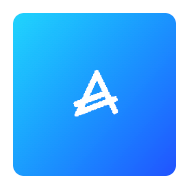

# 📦 EdgeApp - Actual

{ align=left }

 
Actual is **a personal finance app that helps you track your money and manage your budget**. It's a simple and intuitive tool that helps you understand where your money goes and how you can adjust your spending habits.
  

## 🔗 Resources

[App Official Website :octicons-globe-16:](https://actualbudget.com/){ .md-button } [App Documentation :material-file-document:](https://actualbudget.org/docs/){ .md-button }

[App Repository :material-github:](https://github.com/actualbudget/actual){ .md-button } [EdgeApp Package :material-github:](https://github.com/edgebox-iot/apps/tree/main/actual){ .md-button }

!!! info "*EdgeApp internal name reference:* `actual`"

## 📝 Configuration

**This app requires no configuration**, it can be installed and used right away.

## 🏃 First Run

When first accessing Actual, you may be prompted to provide a URL for the server. For an edgebox installation like this, you can choose to add the internet accessible URL to use the same URL as the one you’re accessing Actual from.

## 📖 Usage

### 🖥️ Via Web-Browser

You can access the web version of the app by going the dashboard EdgeApps page and finding the app card, or directly in your browser via the app link.

[Check this documentation page](https://actualbudget.org/docs/tour/) for a tour or Actual's features and how to use them.

!!! note "How to access the app link"

    The app link is the URL that is shown in the app card in the dashboard EdgeApps page. It is usually `http://edgebox.local/actual` for the local network version, and `https://*username*-actual.edgebox.io/actual` for the cloud version.

## ⚖️ Stability Notes

!!! success "Stable"

    This EdgeApp is stable and ready for everyday use.
