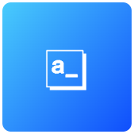

# 📦 EdgeApp - Appsmith

{ align=left }

 
**Appsmith is a low-code app and framework to build internal tools, admin panels, dashboards, and workflows.** It helps you build UIs quickly with a drag-and-drop UI builder and a powerful data editor.
   

## 🔗 Resources

[App Official Website :octicons-globe-16:](https://appsmith.com/){ .md-button } [App Documentation :material-file-document:](https://docs.appsmith.com/){ .md-button }

[App Repository :material-github:](https://github.com/appsmith/){ .md-button } [EdgeApp Package :material-github:](https://github.com/edgebox-iot/apps/tree/main/appsmith){ .md-button }

!!! info "*EdgeApp internal name reference:* `appsmith`"

## 📝 Configuration

**This app requires no configuration**, it can be installed and used right away.

## 🏃 First Run

When first accessing Appsmith, you will be propmpted to create an admin account. This account will be used to manage the app and its users.

## 📖 Usage

### 🖥️ Via Web-Browser

You can access the web version of the app by going the dashboard EdgeApps page and finding the app card, or directly in your browser via the app link.

[Check this documentation page](https://actualbudget.org/docs/tour/) for a tour or Actual's features and how to use them.

!!! note "How to access the app link"

    The app link is the URL that is shown in the app card in the dashboard EdgeApps page. It is usually `http://actual.edgebox.local` for the local or raspberry pi versions wdd, and `https://*username*-actual.edgebox.io` for the cloud version.
