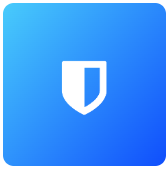

# 📦 EdgeApp - Bitwarden

{ align=left }

 
**Bitwarden is a free and open-source password management service that stores sensitive information such as website credentials in an encrypted vault.** It offers a variety of client applications including a web interface, desktop applications, browser extensions, mobile apps, and a CLI.
   

## 🔗 Resources

[App Official Website :octicons-globe-16:](https://bitwarden.com/){ .md-button } [App Documentation :material-file-document:](https://bitwarden.com/help/){ .md-button }

[App Repository :material-github:](https://github.com/dani-garcia/vaultwarden){ .md-button } [EdgeApp Package :material-github:](https://github.com/edgebox-iot/apps/tree/main/bitwarden){ .md-button }

## 📝 Configuration

**This app requires the following configuration before it can be installed:**

- Admin Token - Master password user to access the admin system. Keep this information somehwere safe, as it will be required if you want to managed advanced aspects of the app, or recover a lost password for an existing account.
- Signups Allowed - Toggle to allow/disallow users to sign up for an account

## 🏃 First Run

When first accessing Bitwarden, you will need to create a user account. Make sure the "Signups Allowed" option is set to "Yes", and then create an account through the Bitwarden App link. Fill in the required information, and click the "Sign Up" button again. You will be logged in to your account, and will be able to start using Bitwarden.

## 📖 Usage

### 🖥️ Via Web-Browser

You can access the web version of the app by going the dashboard EdgeApps page and finding the app card, or directly in your browser via the app link.

[Check this documentation page](https://bitwarden.com/help/getting-started-webvault/) for a tour or Bitwarden's features of the web app version, and how to use them.

!!! note "How to access the app link"

    The app link is the URL that is shown in the app card in the dashboard EdgeApps page. It is usually `http://edgebox.local/actual` for the local network version, and `https://*username*-actual.edgebox.io/actual` for the cloud version.

### 📱 Via Companion App

You can also use the Bitwarden companion apps to access your passwords and other sensitive information. You can download the app for your device from the [Bitwarden download page](https://bitwarden.com/download/), and use it to connect to your Edgebox instance.

[Check this documentation page](https://bitwarden.com/help/article/getting-started-mobile/) for a tour or Bitwarden's features of the mobile app version, and how to use them.

## ⚖️ Stability Notes

!!! success "Stable"

    This EdgeApp is stable and ready for everyday use.
