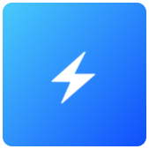

# 📦 EdgeApp - Conduit

{ align=left }

 
**Conduit is a simple, fast and reliable chat server powered by matrix.** It is a communications service that allows you to chat with your friends and family in a reliable and encrypted way, with no intermediaries. It can be used with companion client apps on your devices and computers.
   

## 🔗 Resources

[EdgeApp Package :material-github:](https://github.com/edgebox-iot/apps/tree/main/conduit){ .md-button }

## 📝 Configuration

??? note "*We are still working on this page. It will be updated in the near future.*`"

    Check the Contribution Guidelines if you want to help us with updating this page.

## 🏃 First Run

??? note "*We are still working on this page. It will be updated in the near future.*`"

    Check the Contribution Guidelines if you want to help us with updating this page.

## 📖 Usage

### 🖥️ Via Web-Browser

You can access the web version of the app by going the dashboard EdgeApps page and finding the app card, or directly in your browser via the app link.

!!! note "How to access the app link"

    The app link is the URL that is shown in the app card in the dashboard EdgeApps page. It is usually `http://conduit.edgebox.local` for the local network version, and `https://*username*-conduit.edgebox.io` for the cloud version.

## ⚖️ Stability Notes

!!! warning "Might be Unstable"

    This EdgeApp is still in development and might not be stable enough for everyday use. It is still a work in progress and it is not verified to be fully functional yet.
