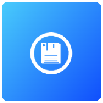

# 📦 EdgeApp - File Browser

{ align=left }

 
**File Browser is a simple file manager that allows you to browse, upload, and download files on your EdgeBox.** It is a simple and intuitive tool that helps you manage your files and folders. It supports reading text and image files, and playing audio and video files.
   

## 🔗 Resources

[EdgeApp Package :material-github:](https://github.com/edgebox-iot/apps/tree/main/filebrowser){ .md-button }

## 📝 Configuration

??? note "*We are still working on this page. It will be updated in the near future.*`"

    Check the Contribution Guidelines if you want to help us with updating this page.

## 🏃 First Run

??? note "*We are still working on this page. It will be updated in the near future.*`"

    Check the Contribution Guidelines if you want to help us with updating this page.

## 📖 Usage

### 🖥️ Via Web-Browser

You can access the web version of the app by going the dashboard EdgeApps page and finding the app card, or directly in your browser via the app link.

!!! note "How to access the app link"

    The app link is the URL that is shown in the app card in the dashboard EdgeApps page. It is usually `http://filebrowser.edgebox.local` for the local network version, and `https://*username*-filebrowser.edgebox.io` for the cloud version.

## ⚖️ Stability Notes

!!! success "Stable"

    This EdgeApp is stable and ready for everyday use.
