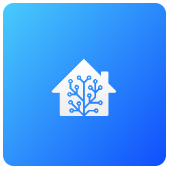

# 📦 EdgeApp - Home Assistant

{ align=left }

 
**Home Assistant is a home automation platform.** It is a tool that helps you automate your home and make it smarter. It supports a wide range of devices and services, and can be easily extended with custom integrations.
   

## 🔗 Resources

[EdgeApp Package :material-github:](https://github.com/edgebox-iot/apps/tree/main/home-assistant){ .md-button }

## 📝 Configuration

??? note "*We are still working on this page. It will be updated in the near future.*`"

    Check the Contribution Guidelines if you want to help us with updating this page.

## 🏃 First Run

??? note "*We are still working on this page. It will be updated in the near future.*`"

    Check the Contribution Guidelines if you want to help us with updating this page.

## 📖 Usage

### 🖥️ Via Web-Browser

You can access the web version of the app by going the dashboard EdgeApps page and finding the app card, or directly in your browser via the app link.

!!! note "How to access the app link"

    The app link is the URL that is shown in the app card in the dashboard EdgeApps page. It is usually `http://home-assistant.edgebox.local` for the local network version, and `https://*username*-home-assistant.edgebox.io` for the cloud version.

## ⚖️ Stability Notes

!!! success "Might be unstable"

    This EdgeApp works but some features might not work as expected. It is not recommended for everyday use.
