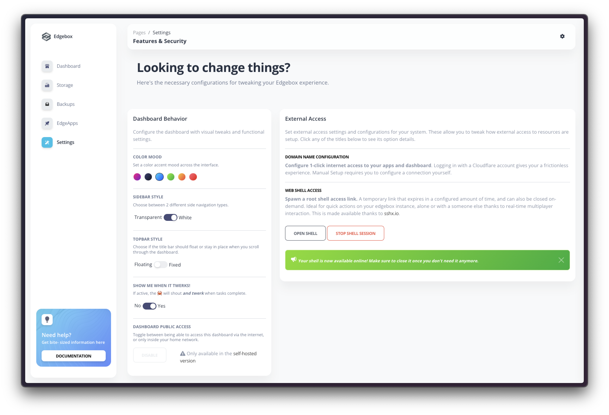

# ⚙️ Settings

**The settings page allows you to change options that affect the dashboard behavior, or the whole system.** It is divided in the following sections:

- **Dashboard Behavior**: These settings affect the dashboard behavior such as visual properties and other access settings.
- **External Access**: These settings affect the external access to the dashboard, such as the custom domain configuration or the web shell session access.

## 🗺️ Dashboard Behavior

### Color Mood

Set a color accent mood across the interface. Choose between the available options to change the color accent of the dashboard. This setting applies immediately to all dashboard pages.

### Sidebar Style

Set the sidebar style. Choose between a transparent look where buttons float in the UI, or a sidebar menu with a white background and defined contours. This setting applies immediately to all dashboard pages.

### Topbar Style

Set the topbar style. Choose between a floating fixed layout where you can always see the title of the dashboard page and have access to the quick settings, or a fixed title that does not follow your scroll position. This setting applies immediately to all dashboard pages.

### Show me when it twerks

!!! info "This is a funny easter egg and is deactivated by default. Please enjoy it and try to find out all the places where "*it twerks!*""

Enable or disable the twerk mode. When enabled, the dashboard will play a sound and show a dancing 🦀 animation when some actions take place. This setting applies immediately and can happen in some dashboard pages.

### Dashboard Access

??? info "This setting is not available in the Cloud Version"

    As the cloud version is always accessible via the internet, this option is blocked and is only available in the Raspberry pi and Local versions.

Toggle the dashboard access via internet. This action restarts all your Edgeapps and applies immediately after clicking. It can take a few seconds to restart all the apps, and you will be redirected to the login page once the process is complete.

## 🌐 External Access

### Domain Name Configuration

Configure a custom domain name to access your Edgebox system. This can be done either via direct connection or via a reverse proxy powered by CloudFlare.

!!! info "For more information and detailed explanation of how this setting works, check the [external access page](/configuration/external-access)."

### Shell Access

Spawn a root shell access link. A temporary link that expires in a configured amount of time, and can also be closed on-demand. Ideal for quick actions on your edgebox instance, alone or with a someone else thanks to real-time multiplayer interaction. Clock the "**Start Session**" button to start a new session. Once a session is started, you can close it or open it via the "_**Open Shell**" button.

!!! info "Fore more information and detailed explanation of this setting, check the [shell access page](/usage/shell-access#accessing-the-shell-via-dashboard)."
